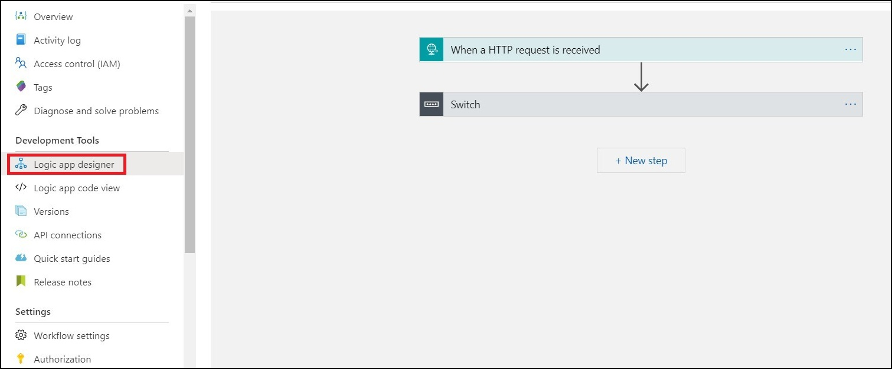
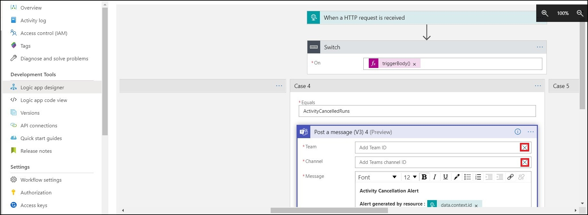
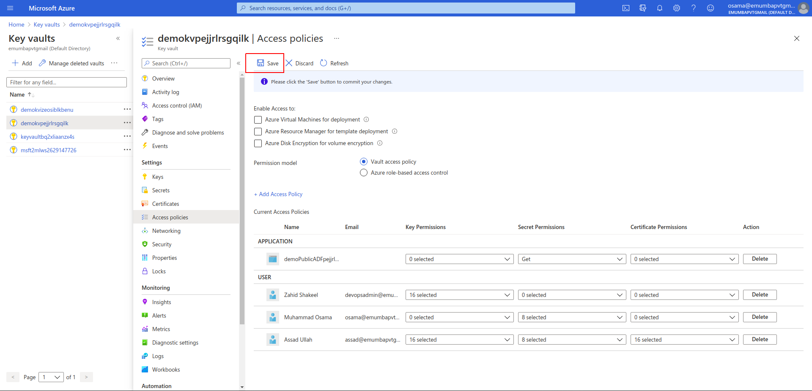
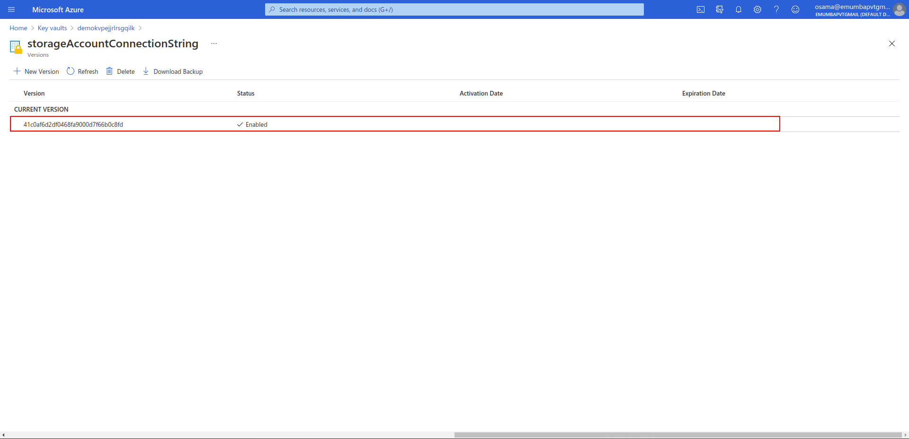

## Table Of Contents:
1. Deploy Data Factory with optional SQL Server and SQL Database
2. Setup and Configure Alerts for Azure Data Factory
3. Configure Data Share
4. Key Vault Secrets And Access Policies

## Deploy Data Factory with optional SQL Server and SQL Database

#### Prerequisites:
1. Resource group for the deployment.

#### To be provided:
1. Resource Group
2. Data Factory Name
3. Storage Account Name
4. Location
5. Option (Yes or No) to deploy or not to deploy SQL Server, SQL Database and SQL sink within the pipeline.
6. If selected **Yes**, please provide

   - SQL Server Name 

   - SQL Database Name
   
   - SQL Server Administrator Username
   
   - SQL Server Administrator Password

7. Notification Email
8. Option (Yes or No) to enable Microsoft Teams Notifications
9. Logic App Name
10. Data Share Account Name.
11. Share Name
12. Option (Yes or No) to deploy and use data share.
13. Key Vault Name.
14. Azure User Object Id.

**NOTE** - If you go with SQL sink, the name of the table where data is written is _**USAFactsDeaths.curatedTable**_.

Click the following button to deploy all the resources.

#### Configure Firewall Rule
After deployment, to access the newly created SQL server from your client IP, configure the firewall rule as described in the following GIF:-

#### Manually Trigger Pipeline

After the deployment, you can go inside your resource group open the ADF **Author and Monitor** section and trigger the pipeline as shown below:-

#### Activate Trigger for the Pipeline

If trigger is deployed along with the pipeline, you have to explicitly activate that trigger as shown below:-

## Setup and Configure Alerts for Azure Data Factory

#### Step 1: Deploy the templates

1. Open git repository for the project and click on **Deploy to Azure**, this will open up a new window.

2. Select your default Azure account (the one you want to deploy Data factory into), and it will take you to the parameters dashboard.

3. Select yes for **"Enable Microsoft Teams Notification"** option if you want to send alerts to Microsoft teams too, otherwise select no if you want Email alerts only.

4. Enter your email address in the field titled **Notification Email** to send alerts notification to that email. You can't enter more than one email at the deployment time, but you can add them later on once the deployment is completed. The method for which will be elaborated below.

5. Click on **Purchase** once you are satisfied with all the parameters and wait for the deployment to end.

Once the deployment is complete, you will have alerts set up in the Azure Data Factory. There will be different features like send alerts to Microsoft Teams(via Logic App) etc depending on the options you selected at the time of deployment.

If you have selected Microsoft Teams notification, then your Logic app needs to be authenticated to your "Microsoft Teams" account for it to be able to send notifications.

#### Step 2: Authenticating Microsoft Teams account with Azure Logic App

1. First, navigate to the resource group that contains your deployment and find the resource titled **"msftTeamsConnectionAuth"**. Click on it and navigate to its **"Edit API connection"** option from the sidebar. 

2. In the window there will be a button titled **"Authorize"**, click on it and it will open up Microsoft sign-in page. Enter the team account credentials and it will authorize you to your team's account.

3. Click on **"Save"** to save the authorization information and navigate to resource group.

4. Now click on the deployed logic app, the default name of which is **"TeamsNotify"**. Click on the option **"Logic app designer"** from the sidebar under heading **"Development tools"**. This will open a visual editor, if there was problem connecting to teams then it will display connection error. In that case, refer back to step 1.

5. Next if the connection is successful, click on **switch** button thats in the designer panel. It will open 6 different cases, click on a case and you will see a box labeled **"Post a message (V3)"**, click on that. Next to select **"Team"** and **"Channel"**, click on the cross button at the right side of these two fields to open up the drop-down menu for available Team and Channel in Teams account. If you cant see your "Team" and "Channel", goto step 1, there might be problem with authentication. Do this for all 6 cases. After Case 6 there is another switch statement, click on that and do the same in the corresponding cases.

6. Finally, click on save and your logic app setup is completed.

With this our setup of Alerts is complete.

Next, we elaborate on how to add multiple emails to the action group.

#### Adding multiple emails to action group

Follow these steps to add multiple emails to receive alerts on.

1. First, type "Alerts" in the Azure search bar. Click on "Alerts" and it will take you to main alerts dashboard.

2. In the top buttons, there is a button **"Manage actions"**, click on that.

3. Once in the manage actions pane, there will be a list of all the action groups. Select your action group.

4. Finally at the bottom in section **Notifications**, there is already an email created which is the default email you entered at the deployment time. Here, you may add as many emails as you want to send alert notifications to.

## Configure Data Share

If you are using data share to get data from a public environment into the customer environment, you need to follow the steps given below after you have run the public side pipeline:-

### Pre-Requisites

#### The user at sending side (public) as well as receiving side (customer) must have 'Owner' role for the data share workflow to function successfully. All the tasks from beginning of the data share workflow at sending side till triggering the snapshot must be performed by the users having 'Owner' role.

### Step 1 - Public Side

1. Open the Data Share Account.

2. Click **Start Sharing your data**.

3. Click on the share named **demo_public_share** (or any other name you have provided while deploying).

4. Under **Datasets** tab, click **Add datasets** and then select **Azure Blob Storage** as dataset type and click *Next*. Then select subscription, resource group and storage account deployed with current deployment and click *Next*.

5. Select **public** container and click *Next*. And now click **Add datasets**.

6. Now under **Invitations** tab click **Add recipient**.

7. In the blade opened, click **Add recipient** and provide the customer side email and click **Add and send invitation**.

### Step 2 - Customer Side

1. Go to Data Share Invitations.

2. Click on **demo_public_share** (or any other name you have provided while deploying at public side).

3. Agree to the terms of use and provide subscription, resource group, data share account and received share name. Click **Accept and configure**.

4. Under the *Datasets* tab, checkmark the dataset and click **Map to target**.

5. Provide the storage account name (the one deployed currently) along with other options and give the Path as **receivedcopy**. Click *Map to target*. *Note* that the Path is the container name and cannot contain capital letters.

6. Now under *Details* tab, click **Trigger snapshot** and then click **Full copy**.

7. Optionally you can enable the snapshot schedule if configured at the public side. For that, checkmark the **Daily** schedule under *Snapshot schedule* tab and click *Enable*.

## Key Vault Secrets And Access Policies

Azure Key Vault is a cloud service for securely storing and accessing secrets. A secret is anything that you want to tightly control access to, such as API keys, passwords, certificates, or cryptographic keys. Here two secrets are being saved in the key vault with access given to the data factory and to the user whose object id will be provided while creating the deployment (details later):

1. SQL server administrator password
2. Connection string for the blob storage 

The user whose object id will be provided is given full access to all secrets, keys and certificates inside the key vault. While the data factory is given GET access to any secret in the key vault.

### Get the User Object Id

Follow these steps to find a user's object ID in the Azure portal:

1. Type Users in the search bar inside azure portal. Click Users.

2. In the All users section, locate the user name whose object id is to be retrieved. Click on the name.

3. Click Profile tab in the left panel, and copy the user's Object ID under Identity section.

### Add Access Policy

User with 'key vault Contributor' role can manage the key vaults. If you have the said 'key vault Contributor' role, follow these steps to give any user or service the access to the keyvault:

1. Type Key vaults in the search bar inside azure portal. Click Key vaults.

2. Click on your key vault's name.

3. Click on Access Policies in the left panel, and then click Add Access Policy.

4. In front of Service Principal, click on None Selected.

5. Search the user name or service name to which the access is to be given. Note that only one resource can be added during one add access policy procedure. Click on the name of the user or service and click select.

6. Select the suitable permissions, from the separate drop downs for keys, secrets and certificates. Click Add.

7. Click Save.

### Update Secret Values

Follow these steps to see and update values of secrets in key vault.

1. Type Key vaults in the search bar inside azure portal. Click Key vaults.

2. Click on your key vault's name and click Secrets in the left panel.

3. To see the secret's value click on the hexadecimal string under Version (CURRENT VERSION only initially). Now click Show Secret Value to see the secret's value.

4. To update the secret's value, click on New Version under the secret's name and above the version list. Enter the secret's value against Value field and click Create.

