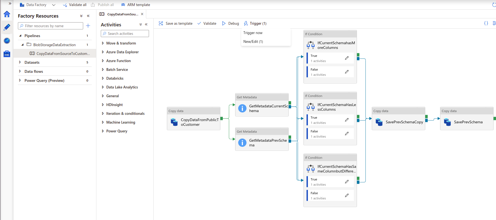
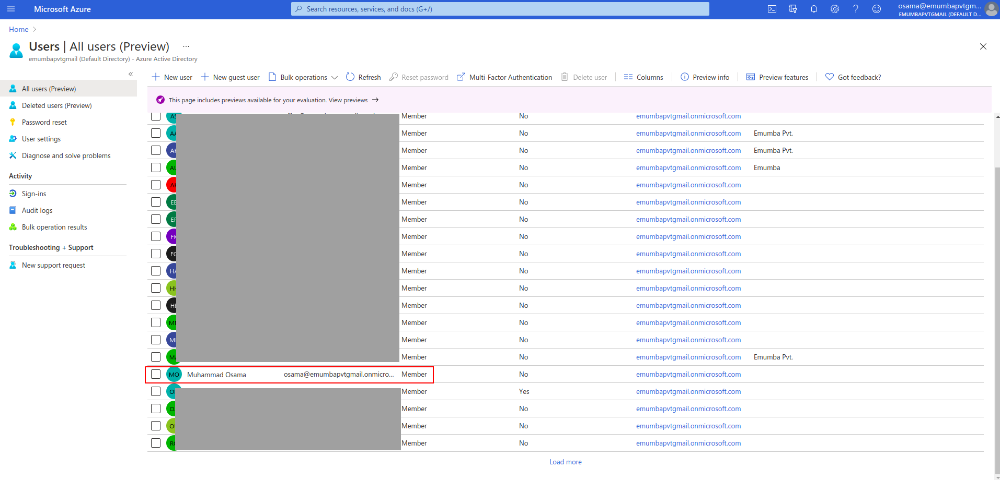
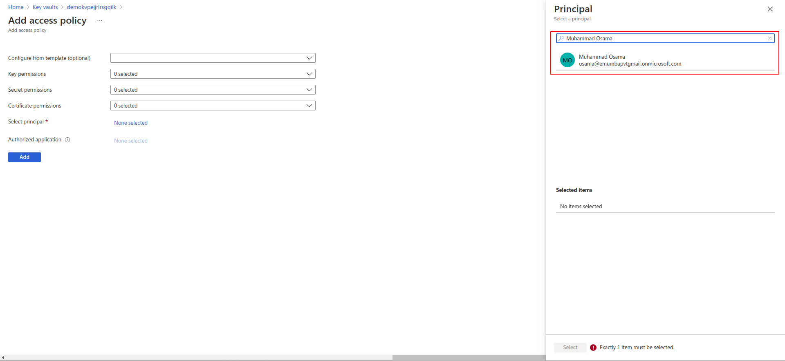
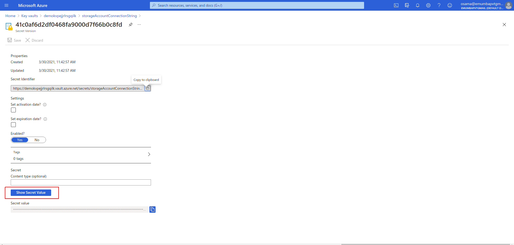
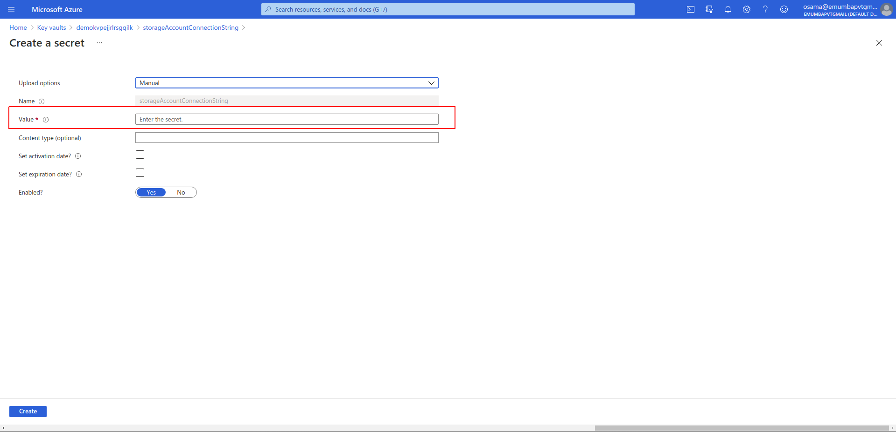

## Table Of Contents:

1. Deploy Data Factory with optional MS Teams notifications
2. Setup and configure SASURI for sharing data
3. Setup and Configure Alerts for Azure Data Factory

## Deploy Data Factory with optional MS Teams notifications

#### Prerequisites:
1. Resource group for the deployment.

#### To be provided:
1. Resource Group
2. Data Factory Name
3. Data Factory Location
4. Storage Account Name (New or existing)
5. Key Vault Name
6. Sas URI
7. Option (yes or no) to enable MS teams notifications
8. Logic App Name
9. Action Group Name
10. Email For Alerts
11. Azure User Object ID
12. Start Trigger Time

Click the following button to deploy all the resources.

#### Manually Trigger Pipeline

After the deployment, you can go inside your resource group open the ADF **Author and Monitor** section and trigger the pipeline as shown below:-

#### Setup and configure SASURI for sharing data

1. Open your storage account from where you want to copy data.
2. Click on the shared access signature from the settings

3. you can select allow services based on storage data including **(Blob, File, Queue and Table)**, select allowed resources types **(Read, write, Delete, List, Add, Create, Update, Process).**
   you can select start and expiry time then click on **Generate SAS and connection string**
   

   
4. Once you click on **Generate SAS and connection string** you can copy blob service sas uri

4. Now you can use value of sas uri in customer account while deploying arm template or you can update the url value from key vault service.

# Setup and Configure Alerts for Azure Data Factory

## Step 1: Deploy the templates

1. Open git repository for the project and click on **Deploy to Azure**, this will open up a new window.

2. Select your default Azure account(the one you want to deploy Data factory into), and it will take you to parameters dashboard.

3. Select yes for **"Enable Microsoft Teams Notification"** option if you want to send alerts to Microsoft teams too, otherwise select no if you want Email alerts only.

4. Enter your email address in the field titled **Notification Email** to send alerts notification to that email. You cant enter more than one email at the deployment time, but you can add them later on once the deployment is completed. The method for which will be elaborated below.

5. Click on **Purchase** once you are satisfied with all the parameters and wait for the deployment to end.

 Now once the deployment is complete, you will have alerts set up in Data Factory. There will be different features like send alerts to Microsoft Teams (via Logic App) etc. depending on the options you selected at deployment time.

If you have selected Microsoft Teams notification, then your Logic app needs to be authenticated to your "Microsoft Teams" account for it to be able to send notifications.

## Step 2: Authenticating Microsoft Teams account with Azure Logic App

1. Navigate to the resource group that contains your deployment and find the resource titled **"msftTeamsConnectionAuth"**. Click on it and navigate to its **"Edit API connection"** option from the sidebar. 

2. In the window there will be a button titled **"Authorize"**, click on it and it will open up the Microsoft sign-in page. Enter the team account credentials and it will authorize you to your team's account.

3. Click on **"Save"** to save the authorization information and navigate to resource group.

4. Now click on the deployed logic app, the default name of which is **"TeamsNotify"**. Click on the option **"Logic app designer"** from the sidebar under heading **"Development tools"**. This will open a visual editor, if there was problem connecting to teams then it will display a connection error. In that case, refer back to step 1.

5. If the connection is successful, click on **switch** button thats in the designer panel. It will open 6 different cases, click on a case and you will see a box labeled **"Post a message (V3)"**, click on that. Next to select **"Team"** and **"Channel"**, click on the **cross** button at the right side of these two fields to open up drop-down menu for available Team and Channel in Teams account. If you cant see your **Team** and **Channel**, goto step 1, there might be problem with authentication. Do this for all 6 cases. After Case 6 there is another switch statement, click on that and do the same in the corresponding cases.

6. Finally, click on save and your logic app setup is completed.

With this our setup of Alerts is complete.

Next we elaborate on how to add multiple emails to the action group.

## Adding multiple emails to an action group

Follow these steps to add multiple emails to receive alerts on.

1. First type "Alerts" in the Azure search bar. Click on "Alerts" and it will take you to the main alerts dashboard.

2. In the top buttons, there is a button **"Manage actions"**, click on that.

3. Once in the manage actions pane, there will be a list of all the action groups. Select your action group.

4. Finally at the bottom in section **Notifications**, there is already an email created which is the default email you entered at the time deployment. Here, you may add as many emails as you want to send alert notifications to.

## Key Vault Secrets And Access Policies

Azure Key Vault is a cloud service for securely storing and accessing secrets. A secret is anything that you want to tightly control access to, such as API keys, passwords, certificates, or cryptographic keys. Here two secrets are being saved in the key vault with access given to the data factory and to the user whose object id will be provided while creating the deployment:

1. SAS URI for blob storage
2. Connection string for the blob storage 

The user whose object id will be provided is given full access to all secrets, keys and certificates inside the key vault. While the data factory has the GET access to the secrets in the key vault.

### Get the User Object Id

Follow these steps to find a user's object ID in the Azure portal:

1. Type Users in the search bar inside azure portal. Click **Users**.

2. In the *All users* section, locate the user name whose object id is to be retrieved. Click on the name.

3. Click *Profile* tab in the left panel, and copy the user's **Object ID** under *Identity* section.

### Add Access Policy

User with **key vault Contributor** role can manage the key vaults. If you have the said **key vault Contributor** role, follow these steps to give any user or service the access to the keyvault:

1. Type Key vaults in the search bar inside azure portal. Click **Key vaults**.

2. Click on your key vault's name.

3. Click on **Access Policies** in the left panel, and then click *Add Access Policy*.

4. In front of *Service Principal*, click on **None Selected**.

5. Search the user name or service name to which the access is to be given. Note that only one resource can be added during one add access policy procedure. Click on the name of the user or service and click **Select**.

6. Select the suitable permissions, from the separate drop downs for keys, secrets and certificates. Click **Add**.

7. Click **Save**.

### Update Secret Values

Follow these steps to see and update values of secrets in key vault.

1. Type Key vaults in the search bar inside azure portal. Click **Key vaults**.

2. Click on your key vault's name and click **Secrets** in the left panel. Click on the secret's name.

3. To see the secret's value click on the hexadecimal string under Version (CURRENT VERSION only initially). Now click *Show Secret Value* to see the secret's value.

4. To update the secret's value, click on **New Version** under the secret's name and above the version list. Enter the secret's value against *Value* field and click *Create*.

